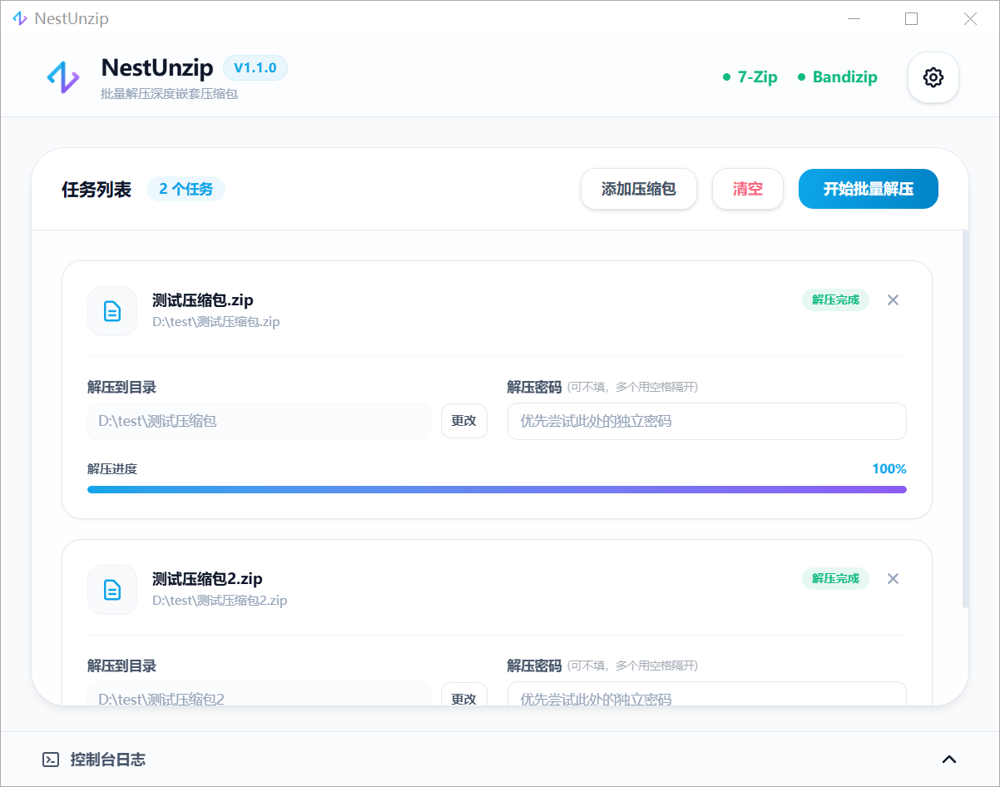

# NestUnzip

NestUnzip 是一款基于 Tauri 构建的高颜值极简解压工具，专为处理深度嵌套、批量解包及多密码尝试等复杂场景而设计。



---

## ✨ 核心亮点

*   **引擎自动检测**：自动检索系统中已安装的 `7-Zip` 或 `Bandizip`，无需手动指定繁琐的执行路径。
*   **深度嵌套解压**：一键穿透多层嵌套的压缩包。中间生成的临时压缩包可配置自动移入回收站或彻底删除。
*   **嵌套防呆处理**：当检测到同级存在多个并排的压缩包时，将自动跳过展开，防止解压逻辑混乱。
*   **单目录自动提升**：解压后若目录内仅包含唯一的子文件夹，将自动提升其内部文件，减少目录层级。
*   **智能密码匹配**：支持配置全局与任务专属密码列表。遇加密包会自动轮询尝试，若密码耗尽则弹窗请求手动输入，成功后自动记忆。
*   **异常安全回滚**：解压中途若遭遇密码错误或文件损坏等异常，将自动把已生成的不完整临时文件清理至回收站，保持目录整洁。
*   **批量任务防覆盖**：支持批量导入，遇到同名目标文件夹会自动追加 `(1)` 等数字后缀进行防冲突处理。
*   **实时流式控制台**：内置可视化终端，实时展示解包进度、层级结构及异常日志。

---

## 🚀 使用指南

### 1. 导入任务
支持将压缩包直接**拖拽**至软件窗口中，或通过“添加压缩包”按钮手动选择。

### 2. 配置密码（可选）
对于包含专属密码的压缩包，可直接在任务卡片中输入密码（多个密码用空格分隔）。同时可在右上角的**设置**中配置常用的全局密码字典。

### 3. 更改路径（可选）
默认将解压至压缩包所在同级目录。如需修改，请点击任务卡片上的“更改”按钮重新指定目标路径。

### 4. 执行解压
勾选需要处理的任务，点击**开始解压**。底部控制台将实时输出进度，解压完成后可配置自动打开目标文件夹。

---

## 🛠️ 开发者指南

### 安装依赖
```powershell
pnpm install --ignore-scripts
```

### 开发调试
```powershell
pnpm tauri dev
```

### 打包发布
```powershell
pnpm tauri build
```
